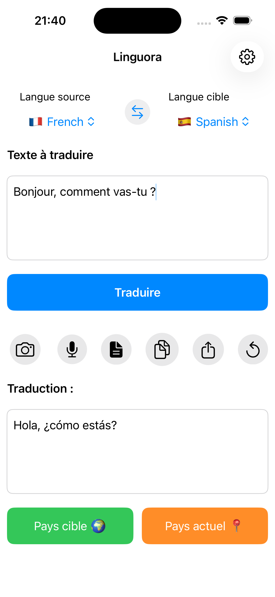
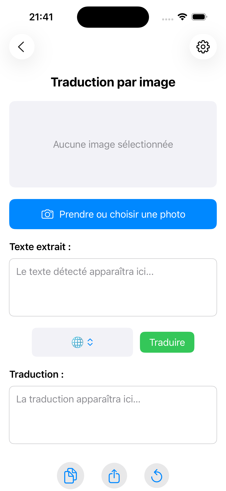
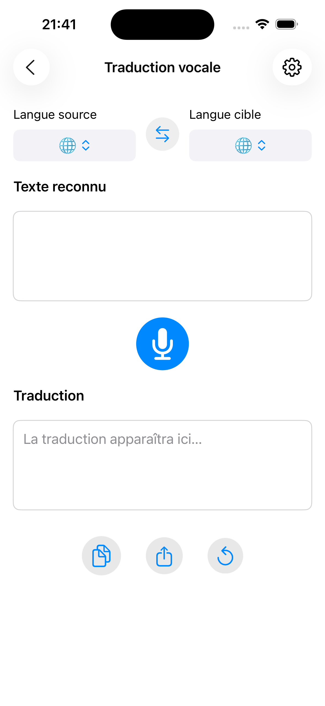
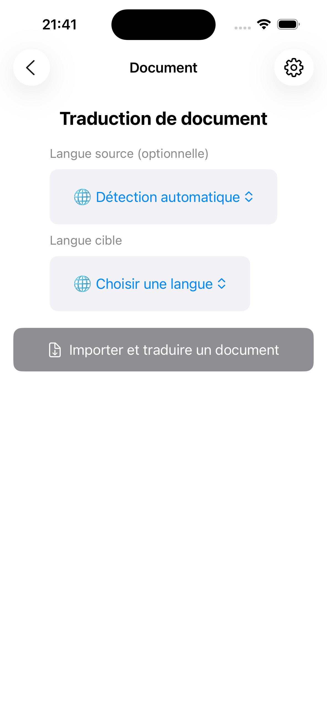
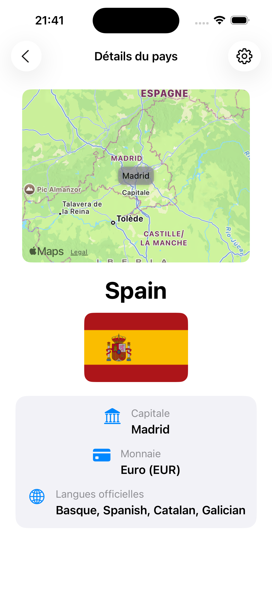

# 📱 Linguora – Application iOS de Traduction Contextuelle via Capteurs

**Linguora** est une application iOS développée en **SwiftUI**, combinant des capteurs embarqués avec des **APIs** pour proposer une traduction enrichie.

---

## 📌 Objectif

Fournir une expérience de traduction intelligente combinant :
- Traduction texte, vocale, OCR, documents
- Informations contextuelles issues des capteurs (GPS, micro, caméra)

---

## 🔧 Stack Technique

- **Langage** : Swift, SwiftUI
- **Frameworks** : CoreLocation, Speech, Vision, UIKit
- **APIs** : DeepL, REST Countries

---

## 🧩 Fonctionnalités principales

- Traduction texte, voix, images, documents
- Informations pays : drapeau, capitale, langue, devise
- Capteurs : GPS, micro, caméra pour OCR

---

## 🖼️ Aperçu

  

  

  

  

  

---

## 👤 Auteur

Développé par [zpilia](https://github.com/zpilia)  
Projet réalisé dans le cadre de la **formation Web@cadémie**, afin d'explorer l'intégration entre les capteurs natifs iOS et les APIs de traduction tierces.

---

## 🪪 Licence

© zpilia — Tous droits réservés.  
L’usage, la reproduction ou la distribution sont soumis à autorisation.

---

# 🇬🇧 English Version

## 📱 Linguora – Sensor-Powered iOS Translation App

**Linguora** is an iOS app using **SwiftUI**, built to combine sensors (GPS, microphone, camera) with APIs for a contextual translation experience.

---

## 📌 Objective

- Text, voice, OCR and document translation
- Country info from GPS: flag, currency, language

---

## 🔧 Tech Stack

- Swift / SwiftUI
- CoreLocation, Speech, Vision, UIKit
- DeepL API, REST Countries API

---

## 🖼️ Preview

  

  

  

  

  

---

## 👤 Developed by

Developed by [zpilia](https://github.com/zpilia)  
Built during the **Web@cadémie** training to explore native sensor integration with third-party translation APIs.

---

## 🪪 License

© zpilia — All rights reserved.  
Use, reproduction or distribution requires explicit permission.
